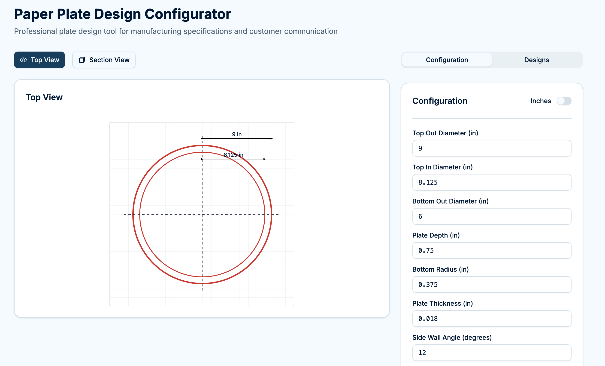
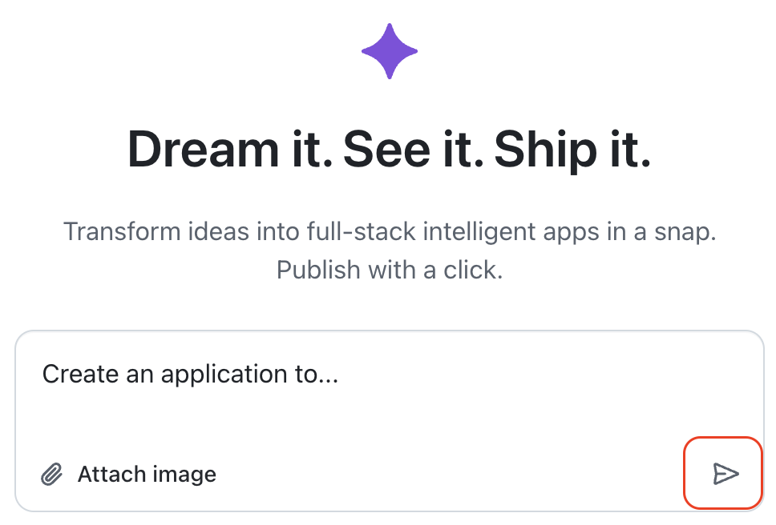
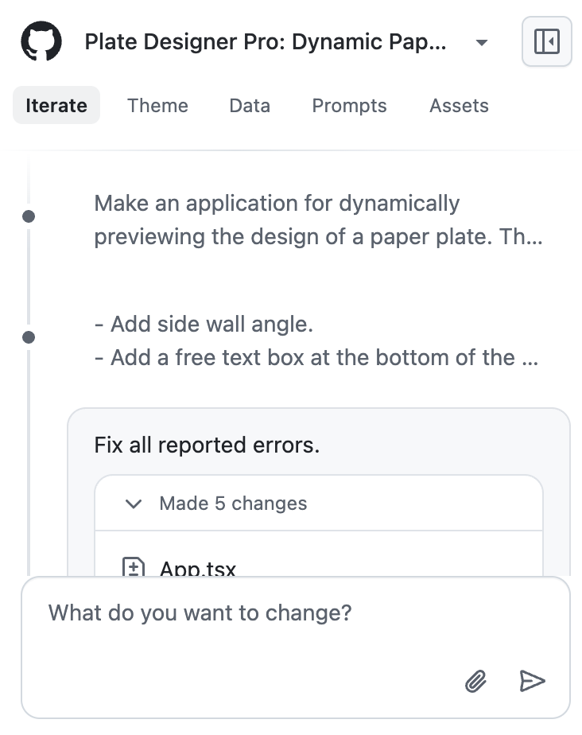

## Step 1: Getting Started with Spark

You're _that person_, the one with ideas and passion. Maybe sometimes people shake their head and laugh at the thoughts you share. You have the great ideas that could help solve problems or improve processes, but you've never had the technical skills to build them.

Today, you'll discover that with GitHub Spark, your ideas can become real web applications that solve real problems for you. All you need is some niche work/hobby knowledge and a little patience to write down what you want to make (the hardest part).

### 📖 Theory: Describing what you want

GitHub Spark is designed for non-coders, really! 😎

It provides everything needed to make your web application and use it, no confusing coder talk at all. From this point on, think of _"Spark"_ as the nickname of a **new** friend/coworker.

That sounds like marketing fluff, _but we mean it._

Like a new coworker/friend, they will understand the basics of your field well, but not any private jargon and the frustrating problems. And... in familiar human style, they will avoid asking questions and just take creative liberty when you don't describe something well. (We all love that! 😅)

Spark is the same way, just faster! 🚀 So, chat a bit, watch the preview update, try to break it, share feedback, repeat.

Spark is:

- **No technical jargon** - Build like working with another person. No special words required (unless you want to).
- **Live preview** - See changes automatically, in minutes, for evolving fast.
- **No systems to manage** - Everything is included. Don't worry about the infrastructure.
<!-- - **Prototyping pro** - You can submit the same description multiple times in parallel to get different results. -->

> [!IMPORTANT]
> Spark's [billing](https://docs.github.com/en/copilot/concepts/billing/billing-for-spark) system operates using [Premium Request Units](https://docs.github.com/en/copilot/concepts/billing/copilot-requests#what-are-premium-requests) (PRUs), a quota of monthly allowed usage. Each request to Spark uses 4 PRUs. Don't feel bad about combining your ideas into fewer longer requests. 😎

### Write a good description

Assuming our friend _Spark_ is shy, likes to avoid questions, but loves to be creative (and explore fun stuff like us), the most important part of getting good results, is clear communication.

We all know starting the app with "Make an app to design paper plates." is pretty generic and probably won't get us what we actually want.

Rather than describe some theories of good communication, let's focus on our fun creative flow, and just get started with an example.

> 🧪 **Pro tip:** Use another AI chat tool, like Copilot on GitHub.com, to brainstorm ideas for your app and clarify vague requirements.

To learn more about Spark's capabilities and billing, check out the [GitHub Spark documentation](https://github.com/features/spark)

### ⌨️ Activity: Explore Spark and Create Your First App

1. Right-click the below link and open Spark in another browser tab.

   [](https://github.com/spark)

1. Read the below sample application descriptions and pick your favorite.

   <details>
   <summary>1. Paper Plates - 🍽️ Prototype Designer</summary><br/>

   

   ```md
   Create an application to design a simple paper plate.
   ```

   </details>

   <details>
   <summary>2. Coffee Shop - ☕️ Secret Menu</summary><br/>

   ```md
   Create an application to help a barista build a secret menu with fellow staff.
   ```

   </details>

   <details>
   <summary>3. Lacrosse Coach - 🥍 Player Improvement</summary><br/>

   ```md
   Create an application to track player improvement stats for coaching lacrosse.
   ```

   </details>

1. Copy your favorite choice and paste it into the description text box, then click the **Submit** button.

   

1. You will be forward to a page with the chat interface and live preview.

   - Your results will likely be different from the example screenshot shared earlier.
   - Notice on the left, that Spark is providing constant feedback about progress.

   

1. Wait a few minutes for Spark to finish. Enjoy the playful messages while you wait!

1. When the app is ready, go to the next comment and select the example application you chose to create..

   - [ ] Paper Plates - 🍽️ Prototype Designer
   - [ ] Coffee Shop - ☕️ Secret Menu
   - [ ] Lacrosse Coach - 🥍 Player Improvement
   - [ ] My Own - Nice! 🧙

> [!TIP]
> If you start multiple Spark apps with the same or similar descriptions, you'll get different results. A great way to explore parallel ideas! But be careful, that will also use up your quota quickly too!

<details>
<summary>Having trouble? 🤷</summary><br/>

- If your app doesn't work well on the first try, don't worry! You can resubmit the same prompt to get a different result
- If it seems to be taking a while, that is normal. A well thought out application with lots of requirements can take a long time, even 20 or 30 minutes.

</details>
