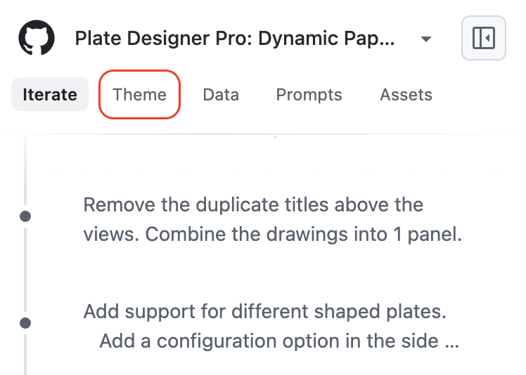
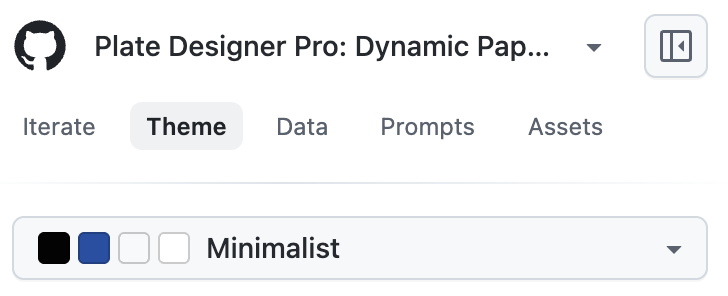
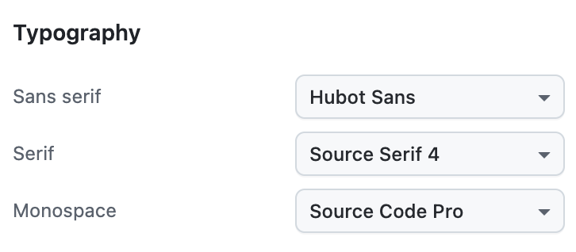
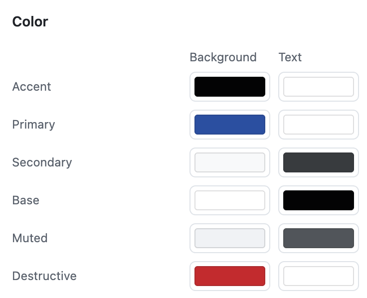
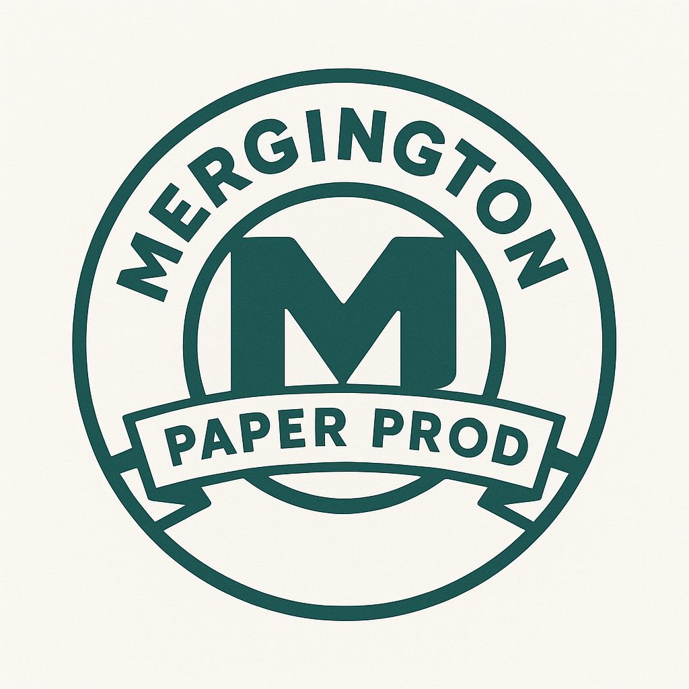
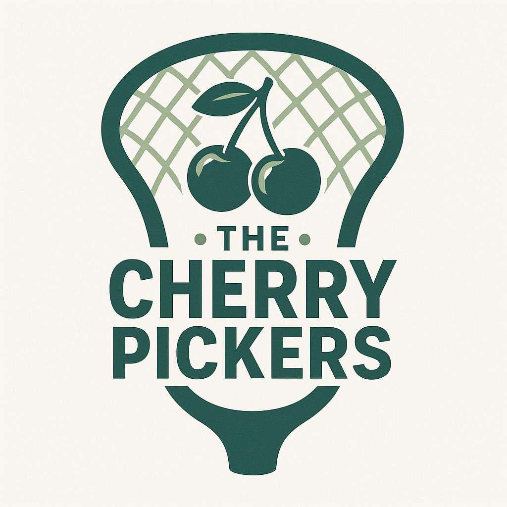
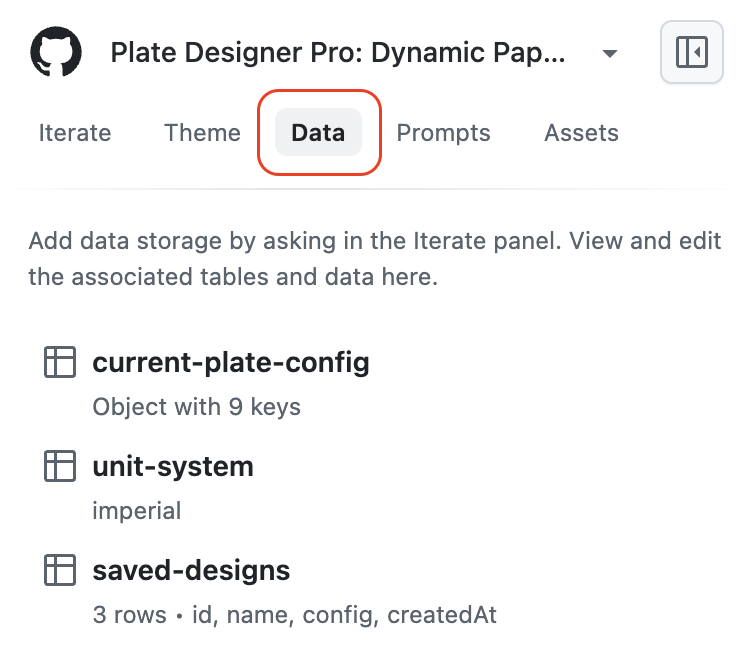
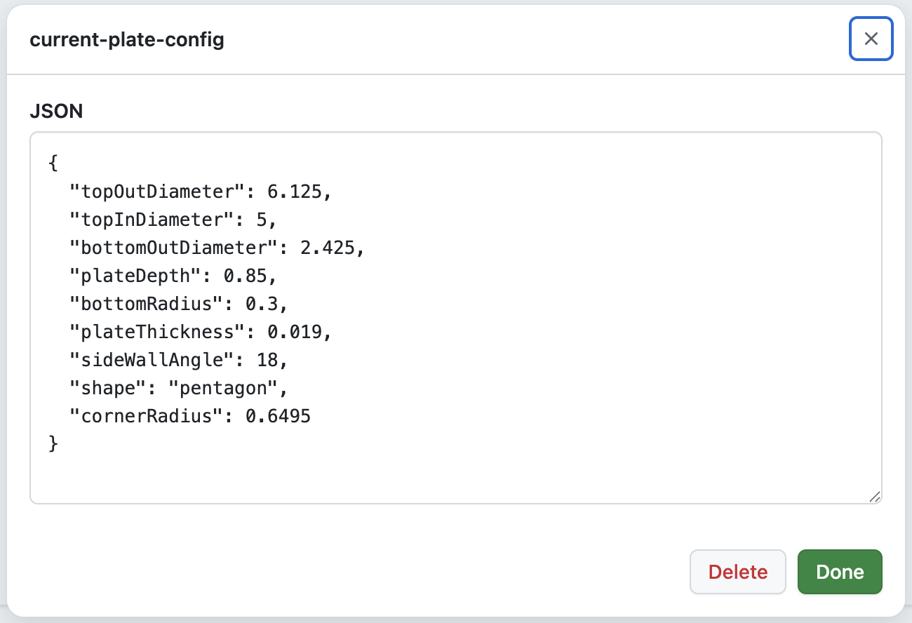
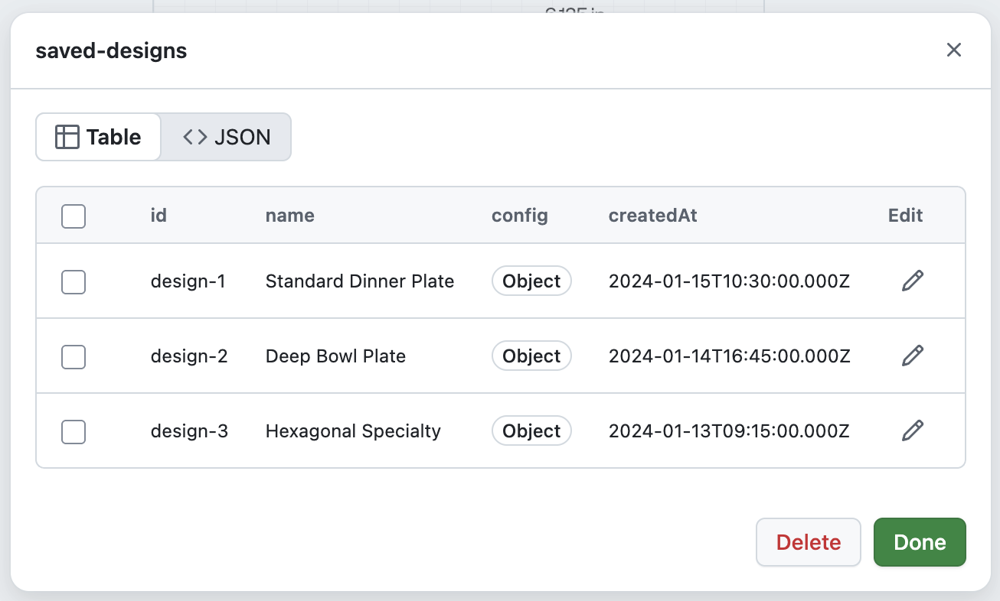

## Step 3: Style Your App

With your app working well now, it's time to do some styling to match your personal brand or design requirements.

Similar to not needing to code, Spark also provides help with basic styling so you don't need to be an expert on color combinations and fonts. 🖍️

Let's explore some of the pre-made suggestions Spark created to modify the feel of your app.

### 📖 Theory: Visual and Data Customization

Spark provides several ways to customize your application:

- **Theme customization**: Easy visual adjustments using the Theme pane to modify colors, fonts, spacing, and overall appearance
- **Asset management**: Upload and incorporate images, logos, or other files into your application
- **Data storage**: Spark automatically provides key-value storage for your app's data, with a built-in interface to view and manage stored information
- **AI capabilities**: Embed intelligent features like chat bots, content generation, and smart automation without complex integrations

### ⌨️ Activity: Personalize Your Design

1. In the left chat panel, at the top, click the **Theme** tab to show controls for changing the appearance.

   

1. Change the color theme to something like `Minimalist` or `Cosmic Latte`. Note: Spark may recommend you different options.

   

1. Experiment with the **Typography** to find a font that matches your app's feel.

   

1. If interested, use the **Color** area to override the Theme and manually set colors.

   

### ⌨️ Activity: (Optional) Add existing files

It's very common to have existing assets, like a company logo, recipe results, or a school mascot. Let's learn how to include those.

1. In the left chat panel, at the top, click the **Assets** tab to show a list of files (probably empty right now).

1. Download one of the below logos that best matches your app.

   | Paper Plate Company              | Coffee Shop Logo                | Lacrosse Mascot |
   | -------------------------------- | ------------------------------- | --------------- |
   |  |  |      |

1. In the left side panel, click the **Upload files** button and choose your file.

1. Ask Spark to add the logo to the site.

   ```md
   I just uploaded a logo. Please add it to the site. I'll let you decide the best place or multiple places, if that makes sense.
   ```

1. Comment below describing what theme changes you made and what data you found in your app. Maybe include a screenshot!

### ⌨️ Activity: (Optional) View Stored Data

Sometimes it is nice to see the stored information to manually modify it. This area is a lightweight step into the technical side of Spark, so it is optional.

1. In the left chat panel, at the top, click the **Data** tab to show a list of data objects. Some are single values and some are tables.

   

1. Click on a few of the items to open an editor for changing the values. Here are some examples:

   | JSON Document | Table       |
   | ------------- | ----------- |
   |    |  |

1. Change a value in one of the tables, then click the **Done** button to save.

1. Check the application to see if the change was applied.

<details>
<summary>Having trouble? 🤷</summary><br/>

- If the theme options don't appear to be updating, try refreshing the page. Sometimes they get out of sync with the live preview.
- If an image no longer shows in the Assets list, don't worry. It wasn't removed. Spark just moved it to a place in the application. You can reference it in requests.

</details>

## Looking good? 🧐

Sorry we even asked. We know you do! 😎 Please pick a random option to continue.

- [ ] My app is obviously fabulous now. 💋
- [ ] I'm not judging, I just like drama and sci-fi. 🤠
- [ ] I call it "eclectic coffee cache". 🤷 ☕️
- [ ] (Custom pun here) 💡
