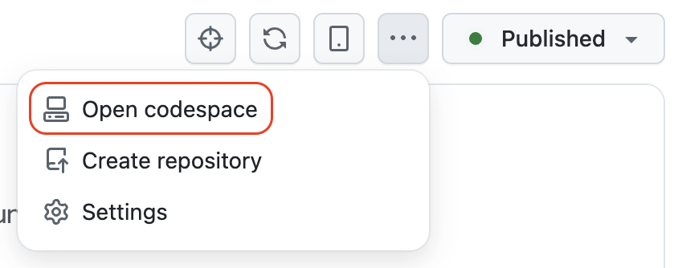
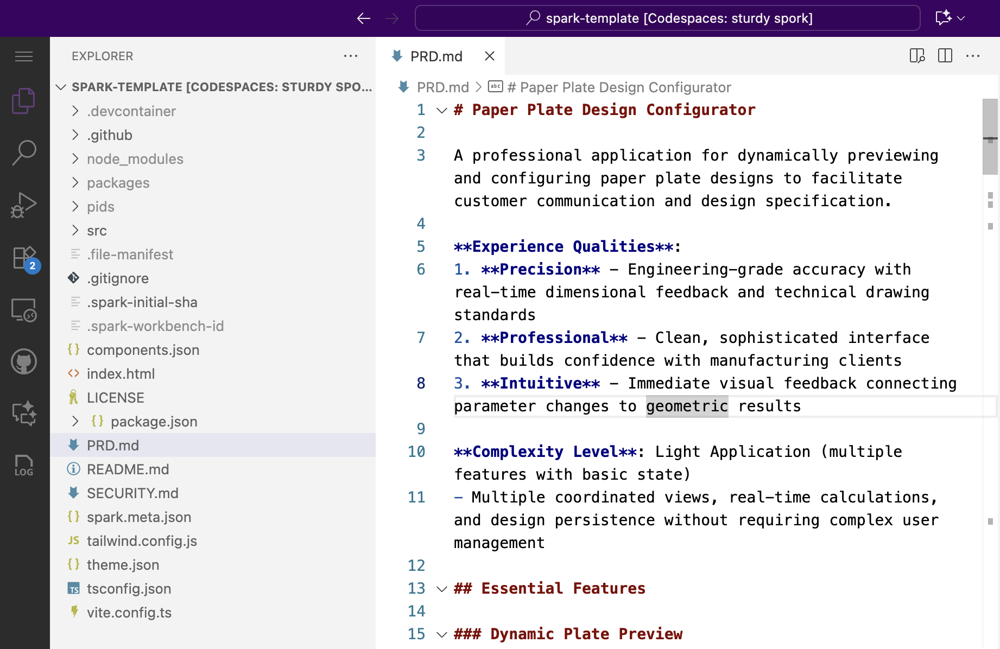
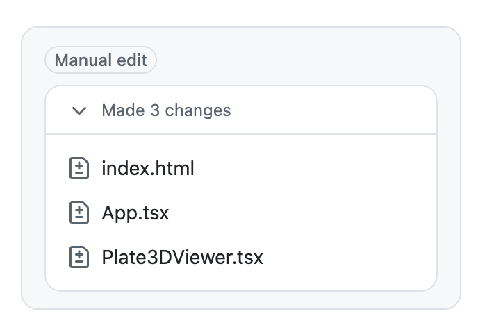
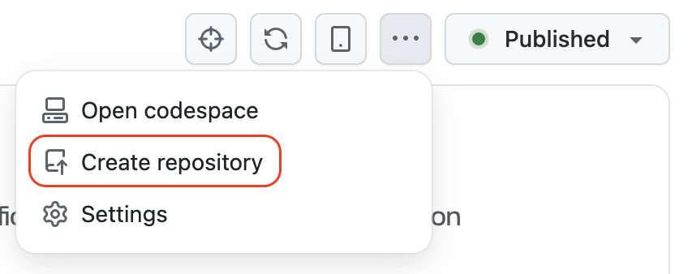
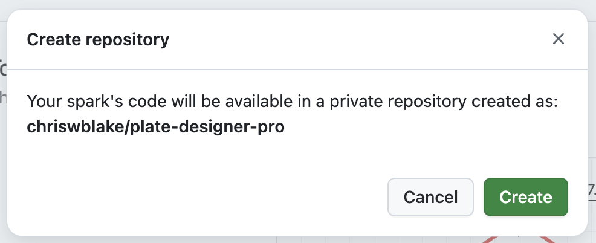
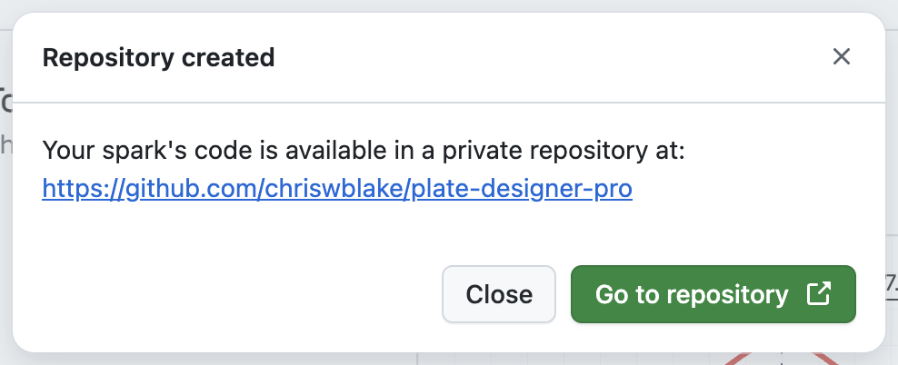

## Step 5: (Optional) Advanced Features and Code

You're amazed at what you've built (and so fast), but what's happening behind the scenes?

Let's explore some of the more coder-oriented features. Maybe this is indeed the _Spark_ of something cooler to come. 🧑‍🚀🚀

Or... maybe you are a just coder and want to change things manually. 👨‍💻

> [!NOTE]
> This step is entirely optional. You can skip straight to the end if you like.
> This step is deliberately more technical for the software developers.

### 📖 Theory: Open the Codespace

Behind every Spark application is a complete codebase running in a cloud-based development environment called a [GitHub Codespace](https://github.com/skills-dev/code-with-codespaces).

Like a regular Codespace, you can open it and start coding manually, just like you do on your regular projects. This provides several advanced capabilities:

- **Code Editing**: View the actual code and assets that power your application and modify it.
- **Copilot**: Use GitHub Copilot Chat for code assistance and explanations.
- **Repository creation**: Save your Spark project as a permanent GitHub repository for version control and collaboration

### ⌨️ Activity: Explore the Codespace

1. Above the live preview, in the top right, find the toolbar.

1. Click the **Three dot (...)** button and select the **Open codespaces** option.

   

1. Wait for the codespace to load in a new browser tab.

1. In the left file navigation, open the `./PRD.md` file to view the notes Spark stores for keeping your application organized.

   

1. Expand the **Copilot Chat Panel** and ask Copilot to change the application title.

   > 
   >
   > ```prompt
   > #codebase
   > Please make the application title more inviting.
   > ```

1. Navigate back to the Spark page. Notice that the live preview is updated and a `Manual edit` entry was added to the left chat panel.

   

### ⌨️ Activity: Save to Repository

1. Above the live preview, in the top right, find the toolbar.

1. Click the **Three dot (...)** button and select the **Create repository** option.

   

1. Click **Create** button to start a private repository under your GitHub account.

   

1. Wait a moment for the repository to be created then press the **Go to repository** button.

   

1. (Optional) begin collaborating with others in your regular style. 🎉

<details>
<summary>Having trouble? 🤷</summary><br/>

- If the **Open Codespace** and **Create repository** options are unavailable, please wait a moment for Spark to finish working.

</details>

## Play time is over 🥹

How was that? Did you have fun? I hope you _sparked_ some new ideas! ✨ After you answer, you are all done! 🎉

- [ ] Surprisingly fun! 🤓
- [ ] I prefer a non-committal answer!
- [ ] Didn't really like it. 👎 (thanks for your honesty)
- [ ] It was bad. I was basically forced to start an issue to share feedback. 📝
